# 30 day chart challenge 2021  
my repository for the [30 day chart challenge](https://github.com/Z3tt/30DayChartChallenge_Collection2021)!  

# Group 1: Comparisons  

## Day 1: Part-to-whole  

## Day 2: Pictogram  

## Day 3: Historical  

  
   

## Day 4: Magical

## Day 5: Slope

  
   

## Day 6: Slope

  
   

# Group 2:

## Day 7: Physical

## Day 8: Animals

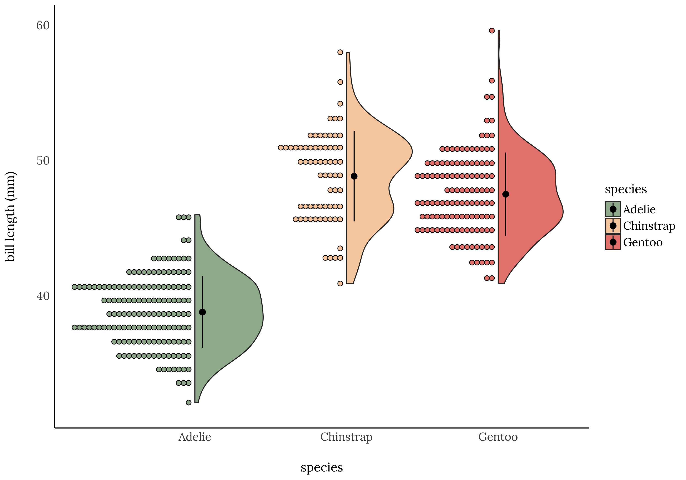
                                                                  

## Day 9: Statistics

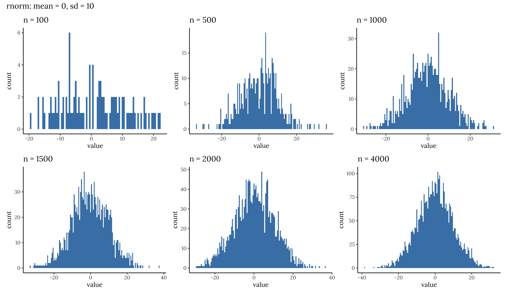

## Day 10: Abstract

  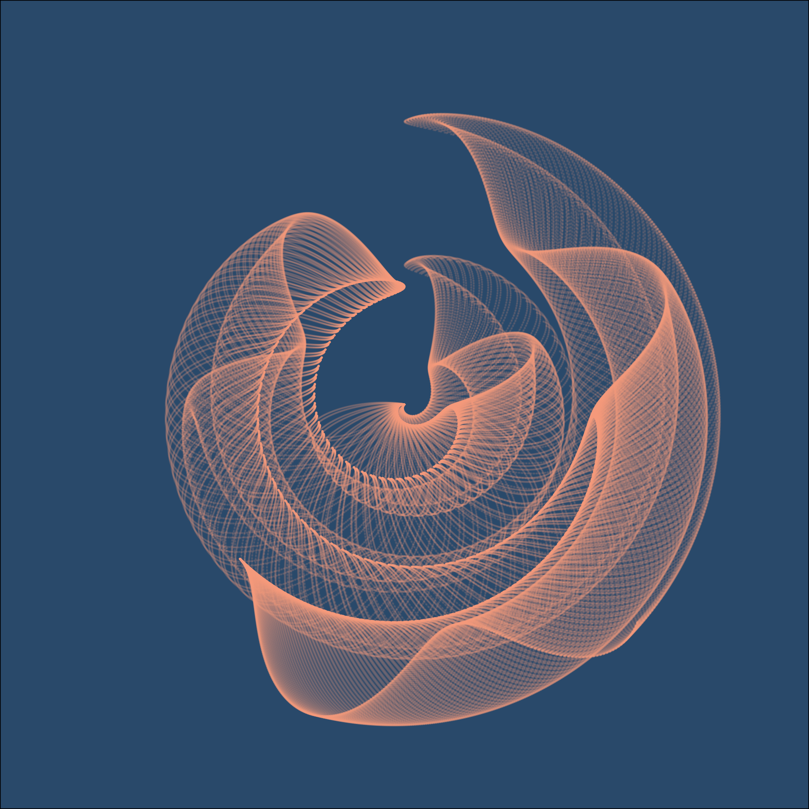
  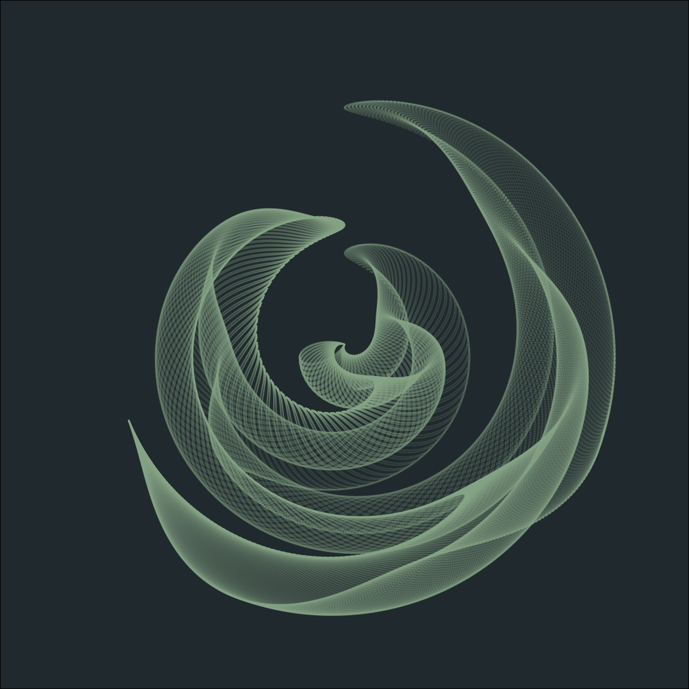 

  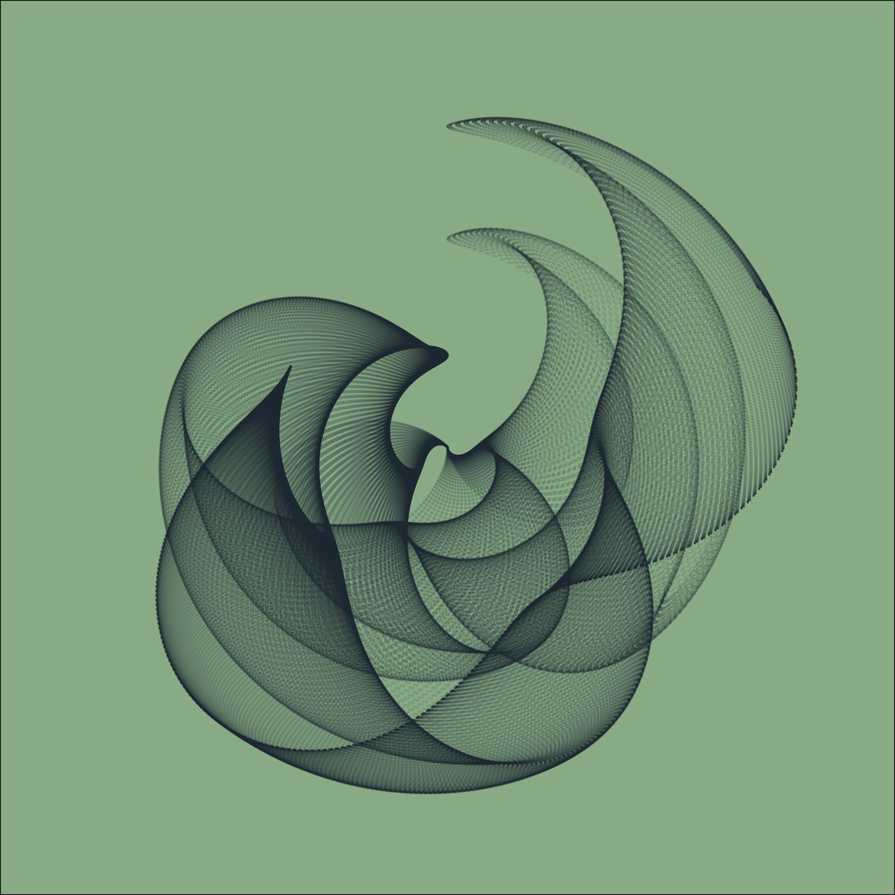
  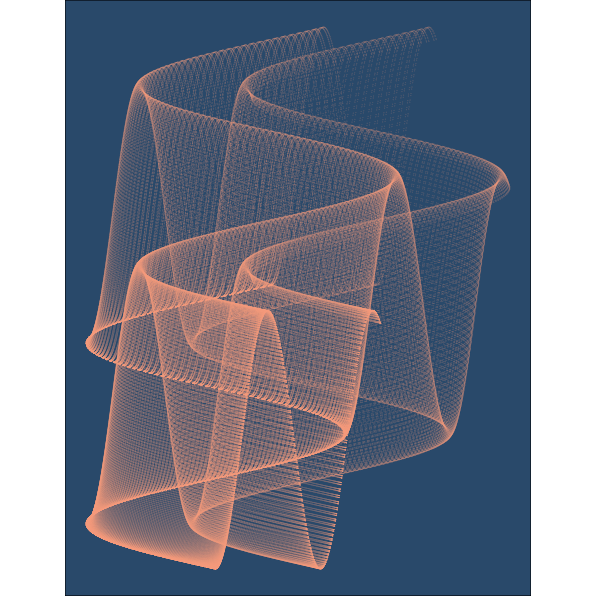 

                                                                 

## Day 11: Circular

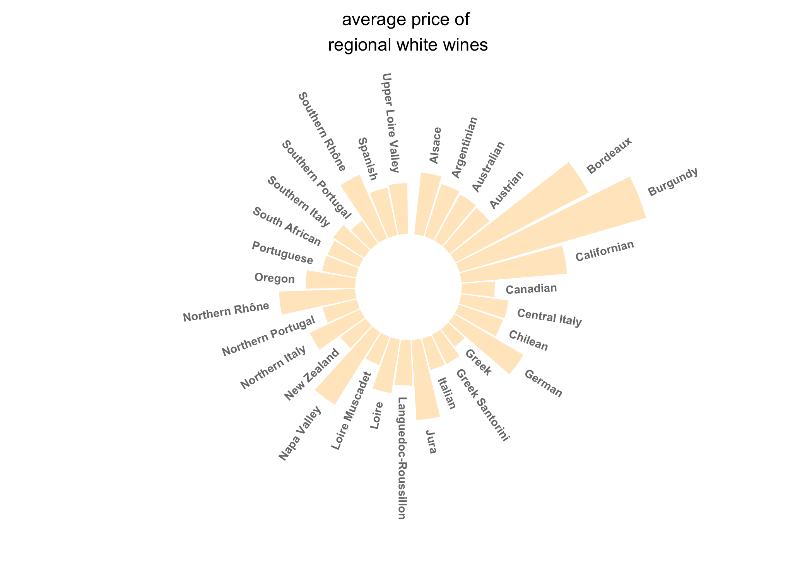

## Day 12: Strips

  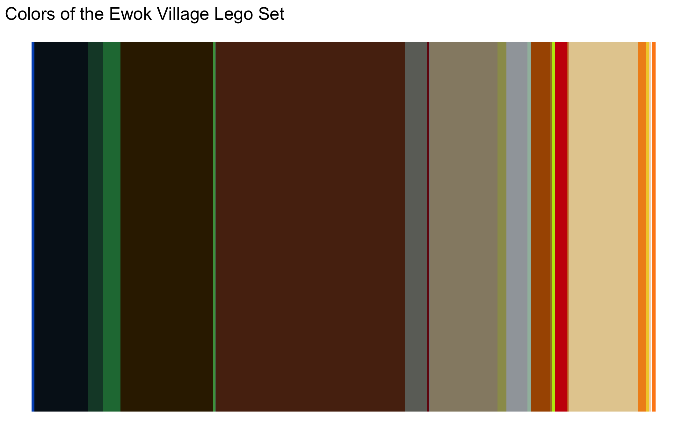
  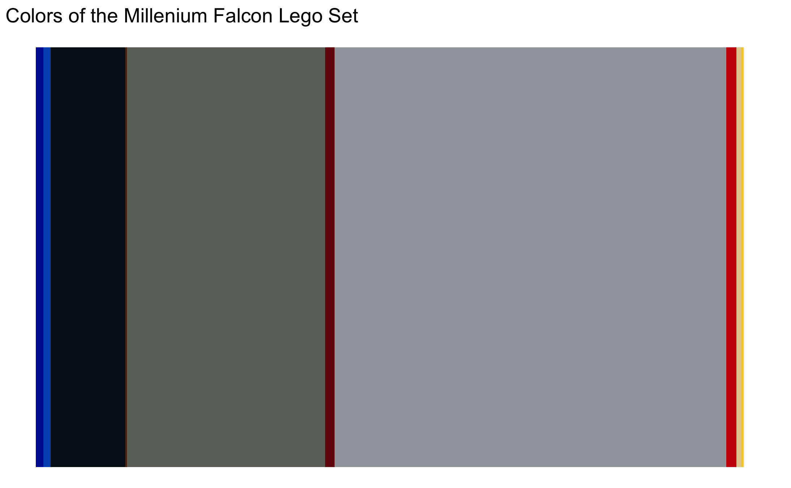 

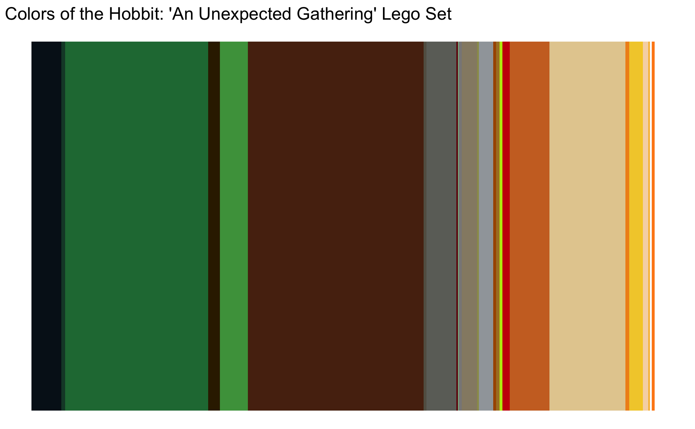

# Group 3: Relationships

## Day 13: Correlation

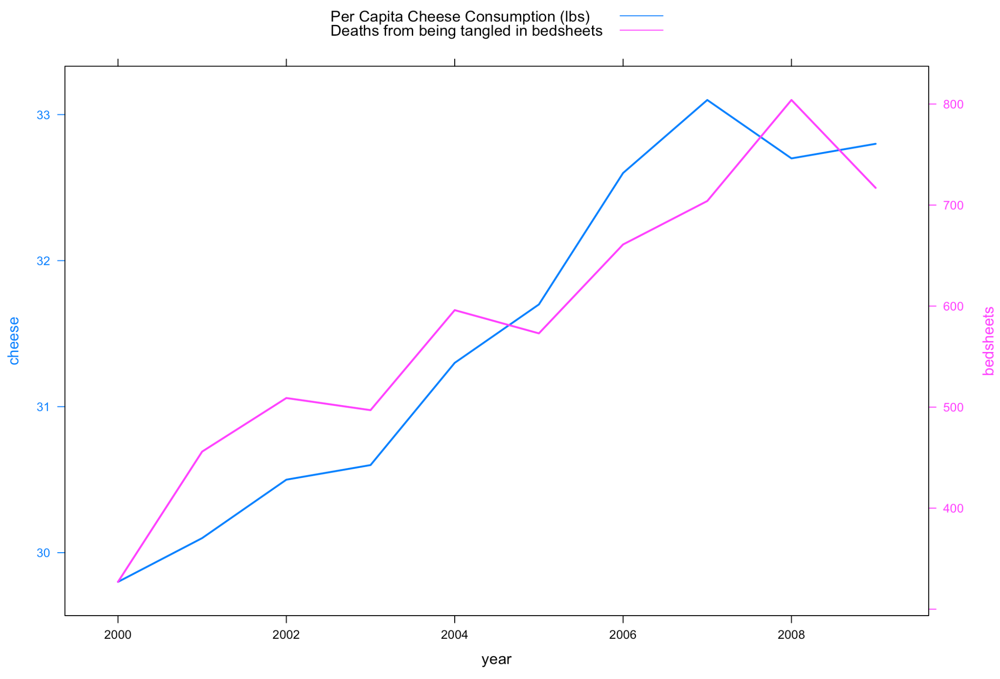

## Day 14: Space

## Day 15: Multivariate

## Day 16: Trees

## Day 17: Pop culture

## Day 18: Connections
