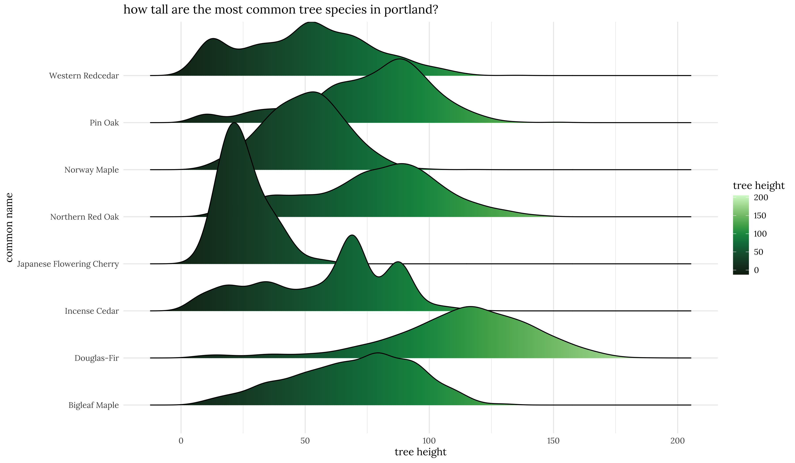

# 30 day chart challenge 2021  
my repository for the [30 day chart challenge](https://github.com/Z3tt/30DayChartChallenge_Collection2021)!  

# Group 1: Comparisons  

## Day 1: Part-to-whole  

## Day 2: Pictogram  

## Day 3: Historical  

  
   

## Day 4: Magical

## Day 5: Slope

  
   

## Day 6: Slope

  
   

# Group 2:

## Day 7: Physical

## Day 8: Animals

## Day 9: Statistics

## Day 10: Abstract

## Day 11: Circular

## Day 12: Strips
