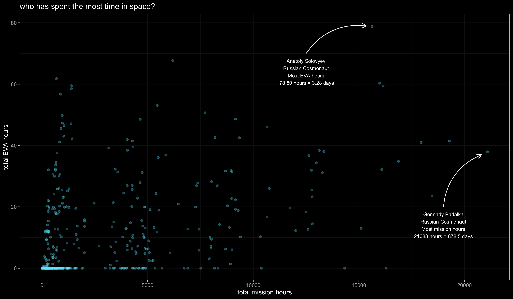
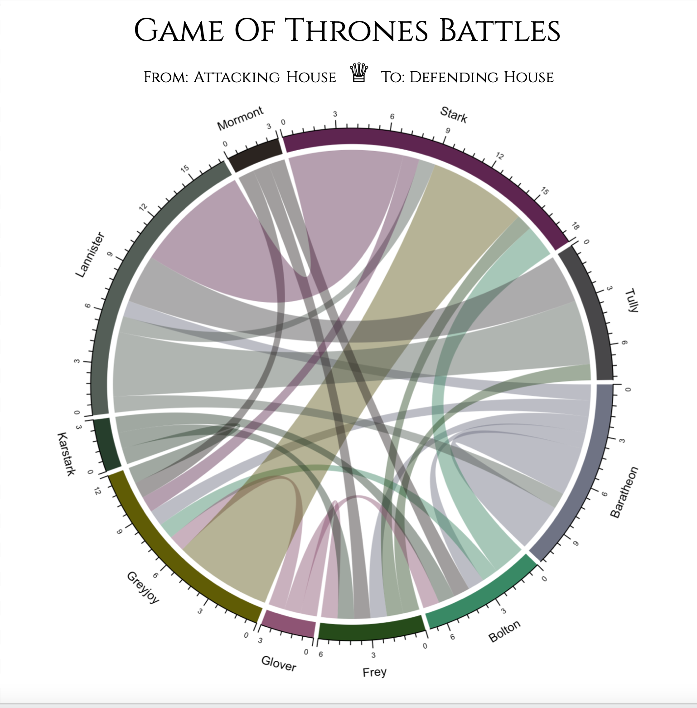
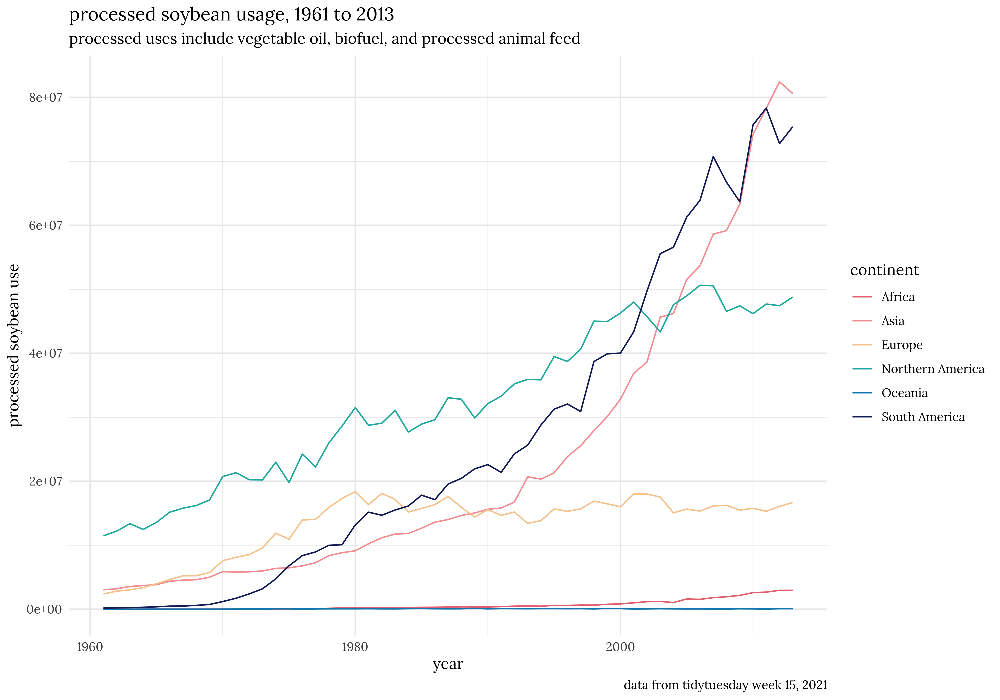
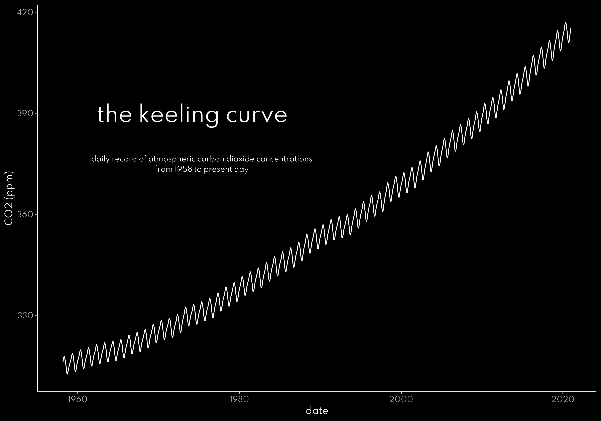
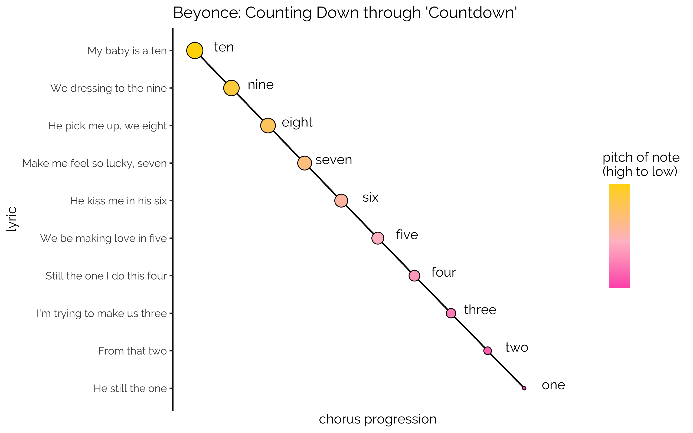
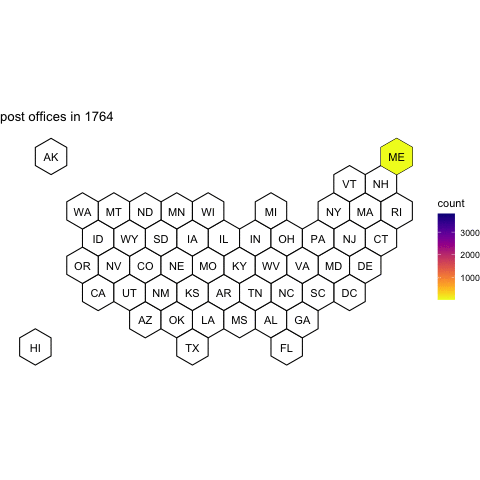

# 30 day chart challenge 2021  
my repository for the [30 day chart challenge](https://github.com/Z3tt/30DayChartChallenge_Collection2021)!  

# Group 1: Comparisons  

## Day 1: Part-to-whole  

## Day 2: Pictogram  

## Day 3: Historical  

  
   

## Day 4: Magical

## Day 5: Slope

  
   

## Day 6: Experimental

  
   

# Group 2:

## Day 7: Physical

## Day 8: Animals

                                                                  

## Day 9: Statistics

## Day 10: Abstract

  
   

  
   

  

## Day 11: Circular

## Day 12: Strips

  
   

# Group 3: Relationships

## Day 13: Correlation

## Day 14: Space

## Day 15: Multivariate

for day 15, i took the day off to celebrate my spring break

## Day 16: Trees

for day 16, i'm sharing some [interactive maps](https://rpubs.com/zolli/pdx_thpl) that i made last summer using the `pdxTrees` package and `leaflet`. enjoy!

## Day 17: Pop culture and Day 18: Connections

# Group 4: Timeseries

## Day 19: Global Change

## Day 20: Upwards

## Day 21: Downwards

## Day 22: Animation

## Day 23: Tiles

## Day 24: Monochrome

# Group 5: Uncertainties 

## Day 25: Demographic

## Day 26: Trends

## Day 27: Educational

## Day 28: Future

## Day 29: Deviations

## Day 30: 3D
