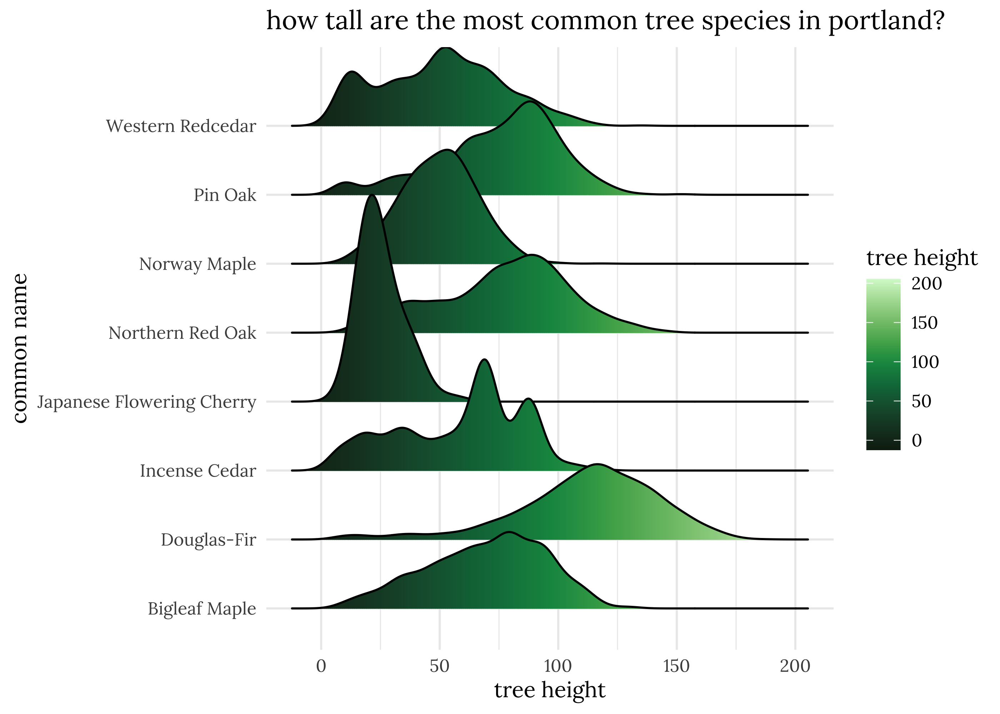

Day 7: Physical
================

``` r
library(tidyverse)
library(ggridges)
library(paletteer)
library(pdxTrees)
library(pals)
library(showtext)
```

``` r
font_add_google("Lora", "lora")
showtext_auto(enable=TRUE)
```

``` r
park_trees <- get_pdxTrees_parks()

trees <- count(park_trees, Common_Name) %>%
  arrange(desc(n)) %>%
  top_n(8) 
mytrees <- trees$Common_Name

common_trees <- park_trees %>%
  filter(Common_Name %in% mytrees)

count(common_trees, Common_Name)
```

    ## # A tibble: 8 x 2
    ##   Common_Name                   n
    ##   <chr>                     <int>
    ## 1 Bigleaf Maple               490
    ## 2 Douglas-Fir                6783
    ## 3 Incense Cedar               507
    ## 4 Japanese Flowering Cherry   418
    ## 5 Northern Red Oak            736
    ## 6 Norway Maple               1502
    ## 7 Pin Oak                     619
    ## 8 Western Redcedar            964

``` r
ggplot(common_trees, aes(x=Tree_Height, y=Common_Name, fill=stat(x)))+
  geom_density_ridges_gradient(scale=3)+
  scale_fill_paletteer_c("pals::ocean.algae", name="tree height")+
  labs(x="tree height", y="common name", title="how tall are the most common tree species in portland?")+
  theme_minimal()+
  theme(text=element_text(family="lora"))#+
```

<!-- -->

``` r
  #ggsave("images/7-tree-dist.png", width=12)
```
