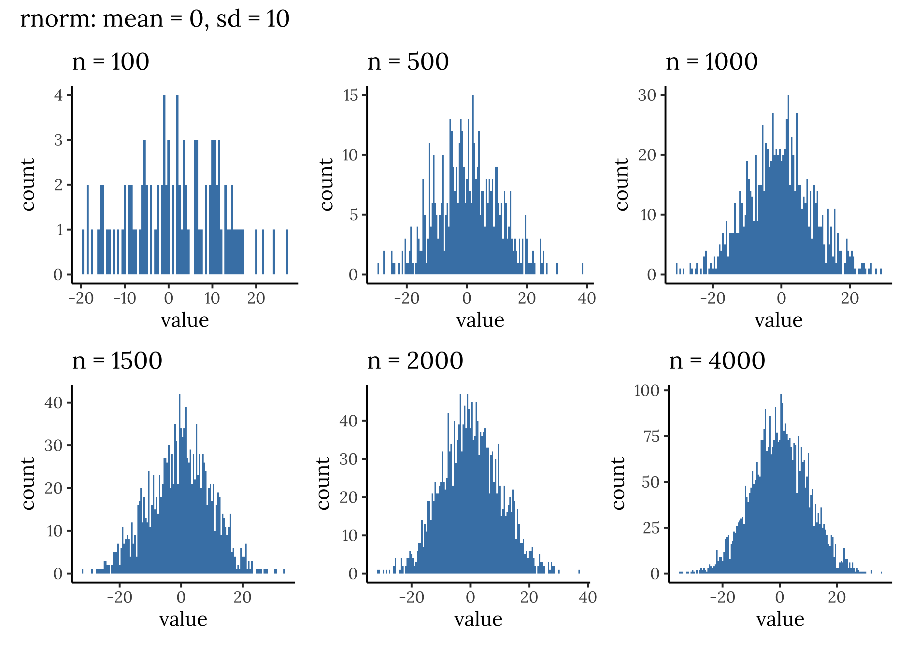

Day 9: Statistics
================

``` r
library(tidyverse)
library(patchwork)
library(showtext)
```

``` r
font_add_google("Lora", "lora")
showtext_auto(enable=TRUE)
```

``` r
rnorm4000 <- as_tibble(rnorm(4000, 0, 10)) %>%
  rename("value"="value") %>%
  mutate(n = 4000)

rnorm2000 <- as_tibble(rnorm(2000, 0, 10)) %>%
  rename("value"="value") %>%
  mutate(n = 2000)

rnorm1500 <- as_tibble(rnorm(1500, 0, 10)) %>%
  rename("value"="value") %>%
  mutate(n = 1500)

rnorm1000 <- as_tibble(rnorm(1000, 0, 10)) %>%
  rename("value"="value") %>%
  mutate(n = 1000)

rnorm500 <- as_tibble(rnorm(500, 0, 10)) %>%
  rename("value"="value") %>%
  mutate(n = 500)

rnorm100 <- as_tibble(rnorm(100, 0, 10)) %>%
  rename("value"="value") %>%
  mutate(n = 100)

p1<- ggplot(rnorm4000, aes(x=value))+
  geom_histogram(binwidth = .5, fill="steelblue")+
  theme_classic()+
  labs(title="n = 4000")

p2<- ggplot(rnorm2000, aes(x=value))+
  geom_histogram(binwidth = .5, fill="steelblue")+
  theme_classic()+
  labs(title="n = 2000")

p3<- ggplot(rnorm1500, aes(x=value))+
  geom_histogram(binwidth = .5, fill="steelblue")+
  theme_classic()+
  labs(title="n = 1500")

p4<- ggplot(rnorm1000, aes(x=value))+
  geom_histogram(binwidth = .5, fill="steelblue")+
  theme_classic()+
  labs(title="n = 1000")

p5<- ggplot(rnorm500, aes(x=value))+
  geom_histogram(binwidth = .5, fill="steelblue")+
  theme_classic()+
  labs(title="n = 500")

p6<- ggplot(rnorm100, aes(x=value))+
  geom_histogram(binwidth = .5, fill="steelblue")+
  theme_classic()+
  labs(title="n = 100")
```

``` r
(p6 | p5 | p4) / (p3 | p2 | p1) +
  plot_annotation(title="rnorm: mean = 0, sd = 10") &
  theme(text = element_text(family="lora"))
```

<!-- -->

``` r
#ggsave("images/9-rnorm.png", width=12)
```
